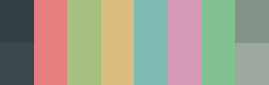

# colourscheme-hub

Modern UNIX customisation is mostly denoted by the use of colourschemes, which alter the colours used by applications.\
More often than not, colourschemes are often created for the theming for GTK, a toolkit used to create many graphical applications.

This repository acts as a centralised hub for the discovery and showcase of different GTK colourschemes for newcomers to the ricing scene, or for ricers searching for something fresh.\
For now this repository will only cover colourschemes which have a GTK theme counterpart to standard terminal 8 colour ANSI sequence and vice versa.

## Popular colourschemes
| Theme                                | Preview                                                   | Widget
| -------------------------------------| --------------------------------------------------------- | ---------------------------------------|
| 
[arc-dark](https://github.com/Narmis-E/colourscheme-hub/tree/main/arc-dark)
 | </img> | </img> |
| 
[catppuccin](https://github.com/Narmis-E/colourscheme-hub/tree/main/catppuccin)
 | </img> | </img> |
| 
[dracula](https://github.com/Narmis-E/colourscheme-hub/tree/main/dracula)
 | </img> | </img> |
| 
[everforest](https://github.com/Narmis-E/colourscheme-hub/blob/main/everforest/)
 | </img> | </img> |
| 
[gruvbox](https://github.com/Narmis-E/colourscheme-hub/blob/main/gruvbox/)
 | </img> | </img> |
| 
[nord](https://github.com/Narmis-E/colourscheme-hub/tree/main/nord)
 | </img> | </img> |
| 
[onedark](https://github.com/Narmis-E/colourscheme-hub/blob/main/onedark/)
 | </img> | </img> |
| 
[rosepine](https://github.com/Narmis-E/colourscheme-hub/blob/main/rosepine/)
 | </img> | </img> |
| 
[tokyonight](https://github.com/Narmis-E/colourscheme-hub/blob/main/tokyonight/)
 | </img> | </img> |

