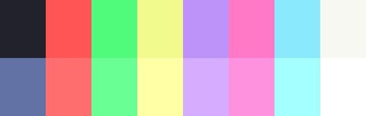

# colourscheme-hub

This repository serves as a centralized hub for discovering and showcasing various GTK colorschemes. Colorschemes are widely used in modern UNIX customization to alter the colors of applications. Whether you're new to ricing or an experienced ricer looking for something new, this repository offers a collection of GTK colorschemes that have a counterpart for standard terminal 8/16-color ANSI sequences and vice versa.

[I want to add a theme!](#adding-your-theme)


## Popular colourschemes
| Theme                                | Preview                                                   | Widget
| -------------------------------------| --------------------------------------------------------- | ---------------------------------------|
| <p align="center">[arc-dark](https://github.com/Narmis-E/colourscheme-hub/tree/main/arc-dark)</p> | </img> | </img> |
| <p align="center">[catppuccin](https://github.com/Narmis-E/colourscheme-hub/tree/main/catppuccin)</p> | </img> | </img> |
| <p align="center">[dracula](https://github.com/Narmis-E/colourscheme-hub/tree/main/dracula)</p> | </img> | </img> |
| <p align="center">[everforest](https://github.com/Narmis-E/colourscheme-hub/blob/main/everforest/)</p> | </img> | </img> |
| <p align="center">[gruvbox](https://github.com/Narmis-E/colourscheme-hub/blob/main/gruvbox/)</p> | </img> | </img> |
| <p align="center">[material](https://github.com/Narmis-E/colourscheme-hub/tree/main/material)</p> | </img> | </img> |
| <p align="center">[monokai](https://github.com/Narmis-E/colourscheme-hub/tree/main/monokai)</p> | </img> | </img> |
| <p align="center">[nord](https://github.com/Narmis-E/colourscheme-hub/tree/main/nord)</p> | </img> | </img> |
| <p align="center">[onedark](https://github.com/Narmis-E/colourscheme-hub/blob/main/onedark/)</p> | </img> | </img> |
| <p align="center">[rosepine](https://github.com/Narmis-E/colourscheme-hub/blob/main/rosepine/)</p> | </img> | </img> |
| <p align="center">[solarized](https://github.com/Narmis-E/colourscheme-hub/blob/main/solarized/)</p> | </img> | </img> |
| <p align="center">[tokyonight](https://github.com/Narmis-E/colourscheme-hub/blob/main/tokyonight/)</p> | </img> | </img> |

<h2 id="adding-your-theme">Adding your theme!</h2>

If you would like to contribute to repository by adding your own theme, please follow these steps:

1. Clone this repository.
2. Make a copy of the `example` directory with the name of your theme.
3. Your theme directory **must** include a `theme_palette.png`, (if you have a GTK theme) a `theme_widgets.png` and the README.md you copied over.
4. In the README, **replace all instances of "Theme" with your theme name** and **"theme" with your theme name in lowercase** (underscores for spaces).
5. Fill out the rest of the README according to the comments (desc, hex codes, theme source)
6. Commit the changes and push them to your forked repository.
7. Open a pull request to merge your changes.
8. If everything looks good I will merge your theme and add it to the list above.
   
## Theme Image formats
I currently don't have an **absolute** set in stone way for others to reproduce the screenshots, but here are the steps I took:
### theme_palette.png:
Using any termial with your theme applied, run the terminal-colors script from your cloned repo (thanks to [eikenb](https://github.com/eikenb/terminal-colors)) and take a screenshot of the output (zoom in if needed). 
This image **MUST** be cropped to the edges of the colours.\
Make sure `imagemagick` is installed and run the following (replace theme with your theme name in lowercase):
```
convert -scale 528x168 <your cropped colour screenshot> {theme}_palette.png
```
or use gimp.

### theme_widgets.png:
This one may be a little more difficult. Install `lxappearance` and make sure your theme is selected from the list on the left (your theme should be placed in `~/.themes` or `/usr/share/themes`).
Then, shrink the window horizontally until it cannot be shrunk anymore and take a screenshot of the inner window preview:

\
e.g here we want to get the cropped preview inside the black borders.\
Save it as {theme}_widgets.png and you should be good to go. It should be near 352x237 but as long as it has a sqaure-ish shape it should look fine.\
If you can't use lxapperance for whatever reason, **please** provide a link to your theme in an issue and I will do it for you.

Again I apologise for not having an absolute method for doing this :/

Happy Ricing!

