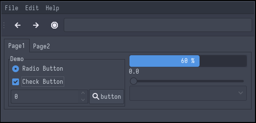

# Arc-Dark
### Description:
A flat theme with transparent elements for GTK 2,3,4 and Gnome-Shell.

### Color Palette:

Arc-Dark

<table>
	<tr>
		<th>Colour</th>
		<th>Hex</th>
	</tr>
	<tr>
		<td>Background</td>
		<td><code>#4B5164</code></td>
	</tr>
  <tr>
		<td>Background-bright</td>
		<td><code>#616981</code></td>
	</tr>
  <tr>
		<td>Red</td>
		<td><code>#E14245</code></td>
	</tr>
  <tr>
		<td>Red-Bright</td>
		<td><code>#E16F7E</code></td>
	</tr>
  <tr>
		<td>Green</td>
		<td><code>#5CA75B</code></td>
	</tr>
  <tr>
		<td>Green-Bright</td>
		<td><code>#ADD488</code></td>
	</tr>
  <tr>
		<td>Yellow</td>
		<td><code>#F6AB32</code></td>
	</tr>
  <tr>
		<td>Yellow-Bright</td>
		<td><code>#FDC35F</code></td>
	</tr>
  <tr>
		<td>Blue</td>
		<td><code>#4877B1</code></td>
	</tr>
  <tr>
		<td>Blue-Bright</td>
		<td><code>#8CA9BF</code></td>
	</tr>
  <tr>
		<td>Magenta</td>
		<td><code>#A660C3</code></td>
	</tr>
  <tr>
		<td>Magenta-Bright</td>
		<td><code>#E2AFEC</code></td>
	</tr>
  <tr>
		<td>Cyan</td>
		<td><code>#5294E2</code></td>
	</tr>
  <tr>
		<td>Cyan-Bright</td>
		<td><code>#73C5E2</code></td>
	</tr>
    <tr>
		<td>Foreground</td>
		<td><code>#A9A9AA</code></td>
	</tr>
    <tr>
		<td>Foreground-Bright</td>
		<td><code>#FCFCFC</code></td>
	</tr>
</table>

### Widgets and UI Elements:

### GTK Themes:
[Maintained Github Repo](https://github.com/jnsh/arc-theme)

### Terminal Theme:

[Kitty](https://github.com/Narmis-E/colourscheme-hub/blob/main/arc-dark/kitty/Arc-Dark.conf)\
[Alacritty](https://gist.github.com/BobbyWibowo/8392af0c1bb3131c6e09b9395968b649)

### Rice Example:

Credits: [teutobald](https://github.com/teutobald)
