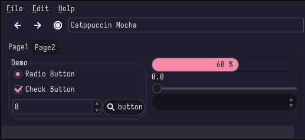

# Catppuccin
### Description:
😸 Soothing pastel theme for the high-spirited!

### Color Palette:

### Widgets and UI Elements:

### GTK Themes:
[Gnome-Look](https://www.gnome-look.org/p/1715554)\
[Official Github](https://github.com/catppuccin/gtk)

### Terminal Theme:

See the [offical github](https://github.com/catppuccin/catppuccin) for all of the terminal themes

### Rice Example:

Credits: [Me!](https://github.com/Narmis-E/bspwm-catppuccin)\
Yes I am aware the bar colour isn't from the palette, or even the wall (it was my first rice)
