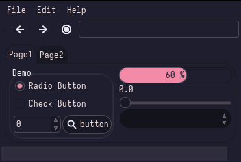

<h1 align="center">Catppuccin</h1>

| Theme | Description | Color Palette | Widgets and UI Elements | GTK Themes |
| :---: | :---: | :---: | :---: | :---: |
| [Catppuccin](https://github.com/catppuccin/catppuccin) | 😸 Soothing pastel theme for the high-spirited! |  |  | - [Gnome-Look](https://www.gnome-look.org/p/1715554) - [Official Github](https://github.com/catppuccin/gtk) - |

🌿 Mocha Palette

| Code | Colour             | Hex       | Code | Colour | Hex       |
|------|--------------------|-----------|------|--------------------|-----------|
| 1    | Background         | `#45475A` | 9  	 | Background-bright  | `#585B70` |
| 2    | Red                | `#F38BA8` | -	 	 | -									|						|
| 3    | Green              | `#A6E3A1` | -    | -									|						|
| 4    | Yellow             | `#F9E2AF` |	-	   | -									|						|
| 5    | Blue               | `#89B4FA` |	-	   | -									|						|
| 6    | Pink             	| `#F5C2E7` |	-	   | -									|						|	
| 7    | Teal               | `#94E2D5` |	-	   | -									|						|
| 8    | Foreground         | `#BAC2DE` | 16   | Foreground-Bright  | `#A6ADC8` |

 

| Terminal Emulators | Theme                                              |
|--------------------|----------------------------------------------------|
| *									 | See the [offical github](https://github.com/catppuccin/catppuccin) for all of the terminal themes |

| Rice Example |
| --- |
|  Rice Credits: [Narmis-E](https://github.com/Narmis-E/bspwm-catppuccin) Yes I am aware the bar colour isn't from the palette, or even the wall (it was my first rice) |