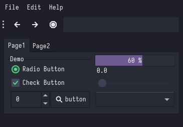

# Dracula
### Description:
A dark theme for GTK.

### Color Palette:

dracula

<table>
	<tr>
		<th>Colour</th>
		<th>Hex</th>
	</tr>
	<tr>
		<td>Background</td>
		<td><code>#000000</code></td>
	</tr>
  <tr>
		<td>Background-bright</td>
		<td><code>#545454</code></td>
	</tr>
  <tr>
		<td>Red</td>
		<td><code>#FF5555</code></td>
	</tr>
  <tr>
		<td>Green</td>
		<td><code>#50FA7B</code></td>
	</tr>
  <tr>
		<td>Yellow</td>
		<td><code>#F0FA8B</code></td>
  </tr>
  <tr>
		<td>Purple</td>
		<td><code>#BD92F8</code></td>
	</tr>
  <tr>
		<td>Pink</td>
		<td><code>#FF78C5</code></td>
	</tr>
  <tr>
		<td>Cyan</td>
		<td><code>#8AE9FC</code></td>
	</tr>
  <tr>
		<td>Foreground</td>
		<td><code>#BBBBBB</code></td>
	</tr>
  <tr>
		<td>Foreground-Bright</td>
		<td><code>#FFFFFF</code></td>
	</tr>
</table>

Note: for some reason the colours lost their bright alts in an update? weird.

### Widgets and UI Elements:

### GTK Themes:
[Official Github Repo](https://github.com/dracula/gtk)

### Terminal Theme:

Search for your terminal [here](https://draculatheme.com/)

### Rice Example:

Credits: [@tuxtarded7635](https://www.youtube.com/@tuxtarded7635/about)
