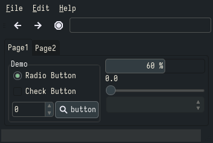

<h1 align="center">Everforest</h1>

| Theme | Description | Color Palette | Widgets and UI Elements | GTK Themes |
| :---: | :---: | :---: | :---: | :---: |
| [Everforest](https://github.com/sainnhe/everforest) | A green based color scheme designed to be warm and soft. |  |  | [Gnome-Look](https://www.gnome-look.org/p/1695467) |

Everforest Palette

| Code | Colour             | Hex       | Code | Colour             | Hex       |
|------|--------------------|-----------|------|--------------------|-----------|
| 1    | Background         | `#343F44` | 9    | Background-bright  | `#3D484D` |
| 2    | Red                | `#E67E80` |	10	 | -									|						|
| 3    | Green              | `#A7C080` | 11   | -									|						|
| 4    | Yellow             | `#DBBC7F` | 12   | -									|						|
| 5	   | Blue	              | `#7FBBB3` | 13   | -									|						|
| 6    | Purple             | `#D699B6` | 14   | -									|						|
| 7    | Aqua               | `#83C092` | 15   | -									|						|
| 8    | Foreground         | `#859289` | 16	 | Foreground-Bright  | `#9DA9A0` |

 

| Terminal Emulators | Theme	                                                                                  |
|--------------------|------------------------------------------------------------------------------------------|
| Kitty              | `kitty +kitten themes`                                                                   |
| Alacritty          | Theme available [here](https://gist.github.com/sainnhe/6432f83181c4520ea87b5211fed27950) |

| Rice Example |
| --- |
| <!-- Image source (probably reddit or github) -->  Rice Credits: [Narmis-E](https://github.com/Narmis-E/openbox-everforest) |