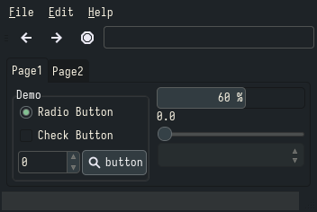

# Everforest
### Description:
A green based color scheme designed to be warm and soft.

### Color Palette:

Everforest

<table>
	<tr>
		<th>Colour</th>
		<th>Hex</th>
	</tr>
	<tr>
		<td>Background</td>
		<td><code>#343F44</code></td>
	</tr>
  <tr>
		<td>Background-bright</td>
		<td><code>#3D484D</code></td>
	</tr>
  <tr>
		<td>Red</td>
		<td><code>#E67E80</code></td>
	</tr>
  <tr>
		<td>Green</td>
		<td><code>#A7C080</code></td>
	</tr>
  <tr>
		<td>Yellow</td>
		<td><code>#DBBC7F</code></td>
  </tr>
  <tr>
		<td>Blue</td>
		<td><code>#7FBBB3</code></td>
	</tr>
  <tr>
		<td>Purple</td>
		<td><code>#D699B6</code></td>
	</tr>
  <tr>
		<td>Aqua</td>
		<td><code>#83C092</code></td>
	</tr>
  <tr>
		<td>Foreground</td>
		<td><code>#859289</code></td>
	</tr>
  <tr>
		<td>Foreground-Bright</td>
		<td><code>#9DA9A0</code></td>
	</tr>
</table>

### Widgets and UI Elements:

### GTK Themes:
[Gnome-Look](https://www.gnome-look.org/p/1695467)

### Terminal Theme:

[Alacritty](https://gist.github.com/sainnhe/6432f83181c4520ea87b5211fed27950)\
Kitty is provided by `kitty +kitten themes`

### Rice Example:

Credits: [Me!](https://github.com/Narmis-E/openbox-everforest)
