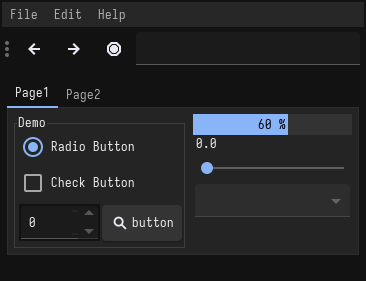

<h1 align="center">Material</h1>

| Theme | Description | Color Palette | Widgets and UI Elements | GTK Themes |
| :---: | :---: | :---: | :---: | :---: |
| [Material](https://github.com/material-theme/vsc-material-theme) | A Material design theme for GNOME/GTK based desktop environments. |  |  | [Github Repo](https://github.com/nana-4/materia-theme) |

Material Palette

| Code | Colour             | Hex       | Code | Colour             | Hex       |
|----------------------|--------------------|-----------|----------------------|--------------------|-----------|
| 1                    | Background         | `#212121` | 9                    | Background-bright  | `#424242` |
| 2                    | Red                | `#B7141E` | 10                   | Red-Bright         | `#E83A3F` |
| 3                    | Green              | `#457B23` | 11                   | Green-Bright       | `#7ABA39` |
| 4                    | Yellow             | `#F5971D` | 12                   | Yellow-Bright      | `#FEE92E` |
| 5                    | Blue               | `#134EB2` | 13                   | Blue-Bright        | `#53A4F3` |
| 6                    | Purple             | `#550087` | 14                   | Purple-Bright      | `#A94DBB` |
| 7                    | Cyan               | `#0E707C` | 15                   | Cyan-Bright        | `#26BAD1` |
| 8                    | Foreground         | `#EEEEEE` | 16                   | Foreground-Bright  | `#D8D8D8` |

 

| Terminal Emulators   | Theme  |
|----------------------|--------|
| Kitty                | `kitty +kitten themes`                                           |
| Alacritty            | Made my own for [Alacritty](./alacritty/alacritty.yml)           |

| Rice Example |
| --- |
|  Credits: [Varlesh](https://github.com/PapirusDevelopmentTeam/materia-kde) |
