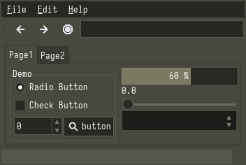

# Monokai
### Description:
A color palette for professional developers.

### Color Palette:

Monokai

<table>
	<tr>
		<th>Colour</th>
		<th>Hex</th>
	</tr>
	<tr>
		<td>Background</td>
		<td><code>#272822</code></td>
	</tr>
  <tr>
		<td>Background-bright</td>
		<td><code>#75715E</code></td>
	</tr>
  <tr>
		<td>Red</td>
		<td><code>#F92672</code></td>
	</tr>
  <tr>
		<td>Green</td>
		<td><code>#A6E22E</code></td>
	</tr>
  <tr>
		<td>Yellow</td>
		<td><code>#E6DB74</code></td>
  </tr>
  <tr>
		<td>Blue</td>
		<td><code>#66D9EF</code></td>
	</tr>
  <tr>
		<td>Orange</td>
		<td><code>#FD971F</code></td>
	</tr>
  <tr>
		<td>Purple</td>
		<td><code>#AE81FF</code></td>
	</tr>
  <tr>
		<td>Foreground</td>
		<td><code>#F8F8F2</code></td>
	</tr>
</table>

### Widgets and UI Elements:

### GTK Themes:
[Github Repo](https://github.com/mitch-kyle/monokai-gtk)

### Terminal Theme:
Kitty provides in `kitty +kitten themes`\
[Alacritty](https://github.com/aarowill/base16-alacritty/blob/master/colors/base16-monokai.yml)

### Rice Example:

\
Credits: [AtomToast](https://github.com/AtomToast/dotfiles)
