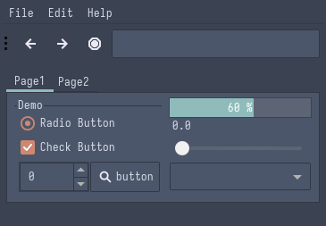

<h1 align="center">Nord (aka Nordic)</h1>

| Theme | Description | Color Palette | Widgets and UI Elements | GTK Themes |
| :---: | :---: | :---: | :---: | :---: |
| [Nord](https://www.nordtheme.com/) | An arctic, north-bluish color palette. |  |  | [Official Github Repo](https://github.com/EliverLara/Nordic) |

Nord Palette

| Code | Colour             | Hex       | Code | Colour             | Hex       |
|------|--------------------|-----------|------|--------------------|-----------|
| 1    | Background         | `#3B4252` | 9    | Background-bright  | `#3D484D` |
| 2    | Red                | `#BF616A` |	10	 | -									|						|
| 3    | Green              | `#A3BE8C` | 11   | -									|						|
| 4    | Yellow             | `#EBCB8B` | 12   | -									|						|
| 5	   | Blue	              | `#81A1C1` | 13   | -									|						|
| 6    | Purple             | `#B48EAD` | 14   | -									|						|
| 7    | Cyan               | `#88C0D0` | 15   | Cyan-Bright				|	`#8FBCBB`	|
| 8    | Foreground         | `#E5E9F0` | 16	 | Foreground-Bright  | `#ECEFF4` |

 

| Terminal Emulators | Theme	                                                                          |
|--------------------|----------------------------------------------------------------------------------|
| Kitty              | `kitty +kitten themes`                                                           |
| *				           | Search for your terminal [here](https://www.nordtheme.com/ports)        					|

| Rice Example |
| --- |
| Rice Credits: [u/cccm5](https://github.com/oh-noey/dotfiles) |