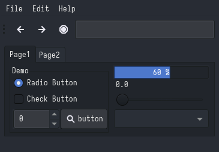

# OneDark
### Description:
A clean, vibrant and pleasing colourscheme based on Atom's iconic One Dark theme.

### Color Palette:

OneDark

<table>
	<tr>
		<th>Colour</th>
		<th>Hex</th>
	</tr>
	<tr>
		<td>Background</td>
		<td><code>#282C34</code></td>
	</tr>
  <tr>
		<td>Background-bright</td>
		<td><code>#5D677A</code></td>
	</tr>
  <tr>
		<td>Red</td>
		<td><code>#E06C75</code></td>
	</tr>
  <tr>
		<td>Green</td>
		<td><code>#98C379</code></td>
	</tr>
  <tr>
		<td>Yellow</td>
		<td><code>#E5C07B</code></td>
  </tr>
  <tr>
		<td>Blue</td>
		<td><code>#61AFEF</code></td>
	</tr>
  <tr>
		<td>Purple</td>
		<td><code>#C678DD</code></td>
	</tr>
  <tr>
		<td>Cyan</td>
		<td><code>#56B6C2</code></td>
	</tr>
  <tr>
		<td>Foreground</td>
		<td><code>#DCDFE4</code></td>
	</tr>
</table>

### Widgets and UI Elements:

### GTK Themes:
[Github Repo](https://github.com/lonr/adwaita-one-dark)

### Terminal Theme:

[Alacritty](https://gist.github.com/r-darwish/f8bb21a6c89a02c4bef76cc38bddad39)\
Kitty provides 'One Half Dark' in `kitty +kitten themes`

### Rice Example:

Credits: [Me!](https://github.com/Narmis-E/hyprland-dots)
