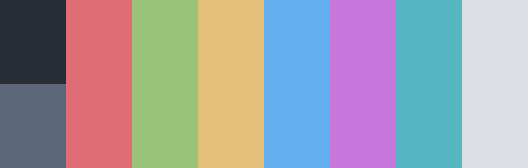

<h1 align="center">OneDark</h1>

| Theme | Description | Color Palette | Widgets and UI Elements | GTK Themes |
| :---: | :---: | :---: | :---: | :---: |
| [OneDark](https://github.com/joshdick/onedark.vim) | A clean, vibrant and pleasing colourscheme based on Atom's iconic One Dark theme. |  |  | [Github Repo](https://github.com/lonr/adwaita-one-dark) |

OneDark Palette

| Code | Colour             | Hex       | Code | Colour | Hex       |
|------|--------------------|-----------|------|--------------------|-----------|
| 1    | Background         | `#282C34` | 9  	 | Background-bright  | `#5D677A` |
| 2    | Red                | `#E06C75` | -	 	 | -									|						|
| 3    | Green              | `#98C379` | -    | -									|						|
| 4    | Yellow             | `#E5C07B` |	-	   | -									|						|
| 5    | Blue               | `#61AFEF` |	-	   | -									|						|
| 6    | Purple            	| `#C678DD` |	-	   | -									|						|	
| 7    | Cyan               | `#56B6C2` |	-	   | -									|						|
| 8    | Foreground         | `#DCDFE4` | -	   | -		  						| 				  |

 

| Terminal Emulators | Theme                                                                                      |
|--------------------|--------------------------------------------------------------------------------------------|
|	Kitty							 | 'One Half Dark' in `kitty +kitten themes`																									|
| Alacritty					 | Theme available [here](https://gist.github.com/r-darwish/f8bb21a6c89a02c4bef76cc38bddad39) |

| Rice Example |
| --- |
|  Rice Credits: [Narmis-E](https://github.com/Narmis-E/hyprland-dots)