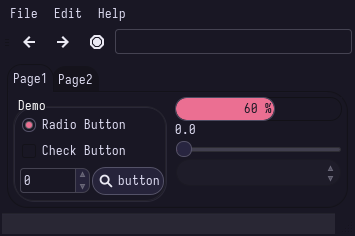

# Rosepine
### Description:
All natural pine, faux fur and a bit of soho vibes for the classy minimalist. 

### Color Palette:

Rosepine

<table>
	<tr>
		<th>Colour</th>
		<th>Hex</th>
	</tr>
	<tr>
		<td>Background</td>
		<td><code>#26233A</code></td>
	</tr>
  <tr>
		<td>Background-bright</td>
		<td><code>#6E6A86</code></td>
	</tr>
  <tr>
		<td>Love</td>
		<td><code>#EB6F92</code></td>
	</tr>
  <tr>
		<td>Pine</td>
		<td><code>#31748F</code></td>
	</tr>
  <tr>
		<td>Gold</td>
		<td><code>#F6C177</code></td>
  </tr>
  <tr>
		<td>Foam</td>
		<td><code>#9CCFD8</code></td>
	</tr>
  <tr>
		<td>Iris</td>
		<td><code>#C4A7E7</code></td>
	</tr>
  <tr>
		<td>Rose</td>
		<td><code>#EBBCBA</code></td>
	</tr>
  <tr>
		<td>Foreground</td>
		<td><code>#E0DEF4</code></td>
	</tr>
</table>

### Widgets and UI Elements:

### GTK Themes:
[Official Github Repo](https://github.com/rose-pine/gtk)

### Terminal Theme:
search for your terminal [here](https://rosepinetheme.com/themes/)

### Rice Example:

Credits: [Me!](https://github.com/Narmis-E/sway-rosepine)
