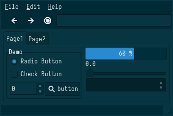

<h1 align="center">Solarized</h1>

| Theme | Description | Color Palette | Widgets and UI Elements | GTK Themes |
| :---: | :---: | :---: | :---: | :---: |
| [Solarized](https://ethanschoonover.com/solarized/) | Precision colors for machines and people. |  |  | [Github Repo](https://github.com/Ferdi265/numix-solarized-gtk-theme) |

Solarized Palette

| Code | Colour             | Hex       | Code | Colour             | Hex       |
|----------------------|--------------------|-----------|----------------------|--------------------|-----------|
| 1                    | Base03		          | `#002731` | 9                    | Base02						  | `#001E26` |
| 2                    | Red                | `#D01B24` | 10                   | Orange		          | `#BD3612` |
| 3                    | Green              | `#728905` | 11                   | Base01				      | `#465A61` |
| 4                    | Yellow             | `#A57705` | 12                   | Base00				      | `#52676F` |
| 5                    | Blue               | `#2075C7` | 13                   | Base0			        | `#708183` |
| 6                    | Magenta            | `#C61B6E` | 14                   | Violet				      | `#5856B9` |
| 7                    | Cyan               | `#259185` | 15                   | Base1			        | `#81908F` |
| 8                    | Base2		          | `#E9E2CB` | 16                   | Base2						  | `#FCF4DC` |

 

| Terminal Emulators    | Theme                                                                                                             |
|----------------------|--------------------------------------------------------------------------------------------------------------------|
| Kitty                | `kitty +kitten themes`                                                                                             |
| Alacritty            | You can find the theme [here](https://github.com/alacritty/alacritty-theme/blob/master/schemes.yaml)        				|

| Rice Example |
| --- |
| Credits: [u/talkfromMind](https://www.reddit.com/r/unixporn/comments/t5yruv/qtile_solarized_dark_first_ever_arch_install_and/) |

