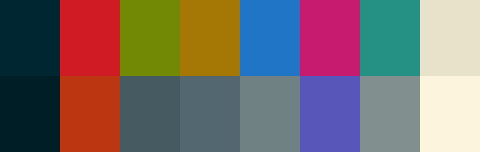

# Solarized
### Description:
Precision colors for machines and people.

### Color Palette:

Solarized

<table>
	<tr>
		<th>Colour</th>
		<th>Hex</th>
	</tr>
	<tr>
		<td>Base03</td>
		<td><code>#002731</code></td>
	</tr>
  <tr>
		<td>Base02</td>
		<td><code>#001E26</code></td>
	</tr>
  <tr>
		<td>Red</td>
		<td><code>#D01B24</code></td>
	</tr>
  <tr>
		<td>Orange</td>
		<td><code>#BD3612</code></td>
	</tr>
  <tr>
		<td>Green</td>
		<td><code>#728905</code></td>
	</tr>
  <tr>
		<td>Base01</td>
		<td><code>#465A61</code></td>
	</tr>
  <tr>
		<td>Yellow</td>
		<td><code>#A57705</code></td>
	</tr>
  <tr>
		<td>Base00</td>
		<td><code>#52676F</code></td>
	</tr>
  <tr>
		<td>Blue</td>
		<td><code>#2075C7</code></td>
	</tr>
  <tr>
		<td>Base0</td>
		<td><code>#708183</code></td>
	</tr>
  <tr>
		<td>Magenta</td>
		<td><code>#C61B6E</code></td>
	</tr>
  <tr>
		<td>Violet</td>
		<td><code>#5856B9</code></td>
	</tr>
  <tr>
		<td>Cyan</td>
		<td><code>#259185</code></td>
	</tr>
  <tr>
		<td>Base1</td>
		<td><code>#81908F</code></td>
	</tr>
    <tr>
		<td>Base2</td>
		<td><code>#E9E2CB</code></td>
	</tr>
    <tr>
		<td>Base3</td>
		<td><code>#FCF4DC</code></td>
	</tr>
</table>

### Widgets and UI Elements:

### GTK Themes:
[Github Repo](https://github.com/Ferdi265/numix-solarized-gtk-theme)

### Terminal Theme:

Kitty provides in `kitty +kitten themes`\
[Alacritty](https://github.com/alacritty/alacritty-theme/blob/master/schemes.yaml)

### Rice Example:

Credits: [u/talkfromMind](https://www.reddit.com/r/unixporn/comments/t5yruv/qtile_solarized_dark_first_ever_arch_install_and/)
