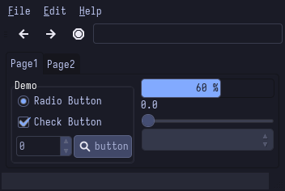

# Tokyonight
### Description:
A clean, dark theme that celebrates the lights of downtown Tokyo at night.

### Color Palette:

Tokyonight

<table>
	<tr>
		<th>Colour</th>
		<th>Hex</th>
	</tr>
	<tr>
		<td>Background</td>
		<td><code>#15161E</code></td>
	</tr>
  <tr>
		<td>Background-bright</td>
		<td><code>#414868A</code></td>
	</tr>
  <tr>
		<td>Red</td>
		<td><code>#F7768E</code></td>
	</tr>
  <tr>
		<td>Green</td>
		<td><code>#9ECE6A</code></td>
	</tr>
  <tr>
		<td>Yellow</td>
		<td><code>#E0AF68</code></td>
  </tr>
  <tr>
		<td>Blue</td>
		<td><code>#7AA2F7</code></td>
	</tr>
  <tr>
		<td>Purple</td>
		<td><code>#BB9AF7</code></td>
	</tr>
  <tr>
		<td>Cyan</td>
		<td><code>#7DCFFF</code></td>
	</tr>
  <tr>
		<td>Foreground</td>
		<td><code>#A9B1D6</code></td>
	</tr>
    <tr>
		<td>Foreground-Bright</td>
		<td><code>#C0CAF5</code></td>
	</tr>
</table>

### Widgets and UI Elements:

### GTK Themes:
[Pling](https://www.pling.com/p/1681315/)

### Terminal Theme:

[Alacritty](https://github.com/zatchheems/tokyo-night-alacritty-theme/blob/main/tokyo-night.yaml)\
Kitty provided in `kitty +kitten themes`

### Rice Example:

Credits: [Me!](https://github.com/Narmis-E/hyprland-dots)
